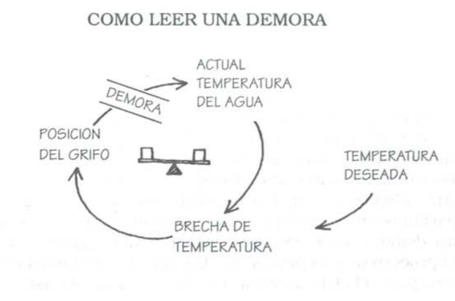
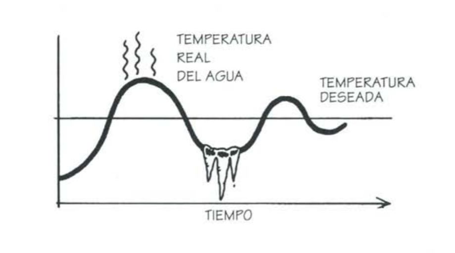

# Capítulo 5: un cambio de enfoque

## Ver el mundo de nuevo

El pensamiento sistémico es una disciplina para ver las "estructuras" que subyacen a las situaciones complejas, y para discernir cambios de alto y bajo apalancamiento. El pensamiento sistémico ofrece un lenguaje que comienza con la reestructuración de nuestro pensamiento.

Hay 2 tipos de complejidad: 
- complejidad de los detalles (los sistemas/simulaciones de las empresas modelan esto)
- complejidad dinámica (situaciones donde la causa y efecto son sutiles, y donde los efectos de la intervención a través del tiempo no son obvios)

Los "análisis de sistemas" se suelen concentrar en la complejidad de detalles, no en la complejidad dinámica. 

La escencia de la disciplina del pensamiento sistémico radica en un cambio de enfoque:
- ver las interrelaciones en vez de las concatenaciones lineales de causa-efecto; y
- ver procesos de cambio en vez de "instantáneas"

Hay que aprender a reconocer "estructuras" iecurrentes y mecanismos de feedback. 

## Círculos de causalidad

La realidad está compuesta de círculos (procesos de realimentación) pero vemos líneas rectas. 

SCREENSHOT PAGS 101 Y 102 MUY IMPORTANTE.

Perspectiva sistémica: menos antropocentrismo: Desde la perspectiva sistémica, el actor humano forma parte del proceso de realimentación, no está separado de él. Esto representa un profundo cambio de concsiencia.

Si todo es circular, no hay chivos expiatorios, sólo gente que puede hacer más o menos apalancamiento. Todos comparten responsabilidad de los problemas.
## Refuerzo y equilibrio de la realimentación y las demoras: los ladrillos deh pensamiento sistémico

2 tipos de procesos de realimentación: 
1. Reforzadora: el tema se potencia
2. Compensadora o estabilizadora: conducta hacia las metas.

Demoras: interrupciones en el flujo de influencia que hacen surgir gradualmente consecuencias. 

### Realimentación reforzadora: cómo crecen los cambios pequeños

Bola de nieve: una pequeña diferencia termina generando un cambio todavía mayor. Puede ser negativo o positivo (círculo virtuoso o vicioso).

Se aceleran rápidamente.

### Procesos compensadores: estabilidad y resistencia

Es un proceso que tiende a no permitir una variación, y que de a poco la compensa, para volver al estado anterior. Resistencia al cambio = procesos compensadores ocultos. Hacer más presión no sirve, hay que encontrar una solución distinta.

### Demoras: la clave es "finalmente"

Cuando el efecto de una variable sobre otra lleva tiempo provoca demotas. Casi todos los procesos de realimentación tienen alguna forma de demora, pero a menudo no se identifican o no se comprenden, llevando a excesos.

La demora genera esto (rizo compensador con demora): oscilación.

También existe en procesos reforzadores.