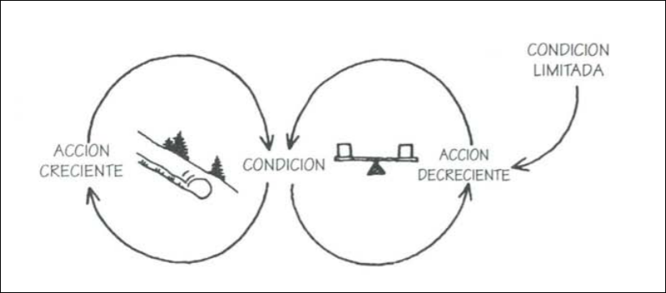

## Capítulo 6: Configuraciones naturales: Patrones que controlan acontecimientos

Estructuras cuya existencia ignoramos nos retienen
prisioneros. Inversamente, al aprender a ver las estructuras
dentro de las cuales operamos, activamos un proceso de liberación respecto de fuerzas antes invisibles y adquirimos
capacidad para trabajar con ellas y modificarlas.

"Arquetippos sistémicos" o "estructuras genéricas": patrones estructurales recurrentes.

### Arquetipo 1: Límites del crecimiento

#### Definición

Un proceso reforzador (amplificador) se pone en marcha
para producir un resultado deseado. Crea una espiral de éxito pero también genera efectos secundarios inadvertidos
(manifestados en un proceso compensador) que eventualmente atentan contra el éxito.

#### Principio administrativo

No precipites el crecimiento; elimina los factores que limitan el crecimiento.

#### Estructura

En los casos de límites del crecimiento, hay un proceso
reforzador (amplificador) de crecimiento o perfeccionamiento
que opera por sí mismo durante un tiempo. Luego se topa
con un proceso compensador (estabilizador), que opera para
limitar el crecimiento. Cuando eso ocurre, la tasa de perfeccionamiento disminuye e incluso se detiene.

#### Patrón de conducta

Primero se crece/mejora y luego se queda fijo, de repente deja de crecer/mejorar.

#### Cómo aplicar la palanca

La mayoría de la gente reacciona ante las situaciones de
límites del crecimiento presionando más. Pero la solución está en el rizo estabilizador: Para cambiar la conducta del sistema, hay que identificar y modificar el factor limitativo.

Pero siempre hay más trabas al crecimiento: La lección fundamental es que el crecimiento eventualmente se detiene. Los esfuerzos para extender el crecimiento
mediante la eliminación de los limites pueden ser contraproducentes porque postergan lo inevitable; el día fatal.

### ARQUETIPO 2: DESPLAZAMIENTO DE LA CARGA

#### Definición

Un problema subyacente genera problemas que reclaman atención. Pero el problema subyacente es difícil de
abordar, porque es engorroso o porque es costoso afrontarlo.
Así que la gente "desplaza la carga" del problema a otras soluciones, arreglos bien intencionados y fáciles que parecen
muy eficaces. Lamentablemente, las "soluciones" fáciles sólo
aplacan los síntomas y dejan intacto el problema subyacente. El problema subyacente empeora, inadvertido porque los
síntomas aparentemente desaparecen, y el sistema pierde toda capacidad para resolver el problema subyacente.

#### Principio administrativo

No solucione los síntomas. Las soluciones que abordan
los síntomas y no las causas fundamentales del problema a
lo sumo brindan beneficios de corto plazo. Eventualmente el
problema resurge y crece la presión por una respuesta ante
el síntoma. Entretanto, la capacidad para dar soluciones
fundamentales se puede atrofiar.

#### Estructura

Compuesta por 2 procesos compensadores. Uno es la intervención contra el síntoma ("solución rápida"). El otro tiene una demora y representa la respuesta más fundamental ante el problema, cuyos efectos tardan más en evidenciarse.

A menudo (aunque no siempre), en estas estructuras
hay también un proceso reforzador (amplificador) creado por
"efectos laterales" de la solución del síntoma. Cuando esto
ocurre, los efectos laterales dificultan aún más la implementación de la solución fundamental.

#### Comprensión y uso de la estructura

Esta estructura explica una amplia gama de conductas
donde las "soluciones" bien intencionadas empeoran las cosas en el largo plazo.

Un caso especial de esta estructura, que se repite con
alarmante frecuencia, es el de "erosión de las metas". Cuando hay una brecha entre nuestras metas y nuestra situación
actual, hay dos conjuntos de presiones: mejorar la situación y reducir nuestras metas.

#### Cómo aplicar la palanca

Para afrontar una estructura de "desplazamiento de la carga" se requiere fortalecer la respuesta fundamental al tiempo
que se debilita la respuesta sintomática. 

#### COMO CREAR NUESTRA PROPIA HISTORIA DE "DESPLAZAMIENTO DE LA CARGA"

La presencia de una estructura de este tipo ofrece
tres indicios. Primero, hay un problema que empeora
gradualmente en el largo plazo, aunque en ocasiones
parece mejorar por un tiempo. Segundo, la salud general del sistema empeora gradualmente. Tercero, hay
una creciente sensación de impotencia. Las personas se
sienten eufóricas al principio (¡han resuelto el problema!) pero al final se sienten como víctimas.

La percepción primaria de la estructura vendrá de (1)
distinguir diversos tipos de soluciones; (2) ver cómo la
dependencia respecto de soluciones sintomáticas puede
generar más dependencia. El apalancamiento siempre
consistirá en fortalecer el círculo inferior y/o debilitar el
círculo superior.
