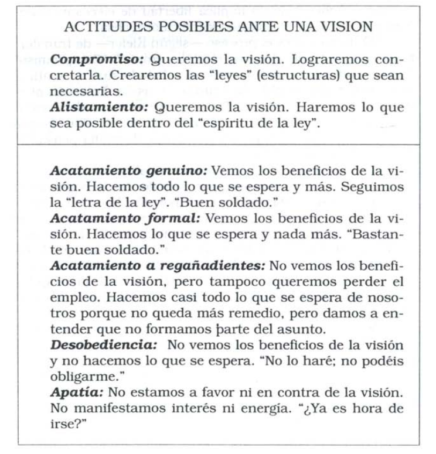

## Capítulo 11: Visión compartida 

### Un interés común

Una visión compartida no es una idea. Es una fuerza en
el corazón de la gente, una fuerza de impresionante poder.

Puede estar inspirada por una idea, pero si es tan convin-
cente como para lograr el respaldo de más de una persona
cesa de ser una abstracción. Es palpable. La gente comienza
a verla como si existiera. Pocas fuerzas humanas son tan po-
derosas como una visión compartida.

una visión compartida es la res-
puesta a la pregunta: "¿Qué deseamos crear?"

### POR QUE IMPORTAN LAS VISIONES COMPARTIDAS

Las visiones compartidas apelan tan naturalmente al
coraje que la gente ni siquiera repara en la dimensión de ese
coraje. Coraje consiste simplemente en hacer lo que se nece-
sita para alcanzar una visión.

No hay organización inteligente sin visión compartida.

La visión compartida alienta la experimentación y el de-
seo de correr riesgos.

La visión compartida alienta el compromiso con el largo plazo. Quizá no sea posible convencer racionalmente a los seres hu-
manos de adoptar una perspectiva de largo plazo.

### La disciplina de construir una visión compartida

#### Alentando la visión personal

Las visiones compartidas surgen de visiones personales.
Así es como obtienen su energía y alientan el compromiso. "Mi visión no es im-
portante para ti. La única visión que te motiva es la tuya"

Las organizaciones que procuran desarrollar visiones
compartidas alientan a los miembros a desarrollar sus visio-
nes personales. Si la gente no tiene una visión propia, a lo
sumo "suscribirá" la visión de otro. El resultado es el acata-
miento, nunca el compromiso.

#### De las visiones compartidas a las visiones personales

Cada visión individual del todo es única. Todos tenemos nuestro propio modo de aprehender la visión más amplia.

Tradicionalmente la visión se la impone desde arriba y no es compartida. Se usa solamente para tomar decisiones estratégicas. Esa visión no sirve para nada porque no es compartida.

Para quienes ocupan puestos de liderazgo, lo más im-
portante es recordar que sus visiones siguen siendo persona-
les. El hecho de que ellos ocupen puestos de liderazgo no
significa que sus visiones personales constituyan automáti-
camente "la visión de la organización"

En Digital construyeron una visión compartida de a poco, originada desde abajo, el tipo se dio la vuelta a la empresa promoviendo y refinando esa visión con feedback.

Las visiones compartidas tardan en emerger. Crecen co-
mo subproducto de interacciones de visiones individuales.

Debemos permitir que coexistan
múltiples visiones, escuchando para sintonizar el rumbo ati-
nado, el cual trasciende y unifica todas las visiones individuales.

#### Difusión de las visiones: alistamiento, compromiso y acatamiento

Las organizaciones tradicionales no se interesaban en el
alistamiento y el compromiso. La jerarquía de comando y
control sólo requería acatamiento.

#### Sugerencias para el alistamiento y el compromiso

- Alístese usted mismo: no venda la visión, vívala.
- Sea franco: no exagere ni oculte sobre la visión.
- Deje que la persona elija: no convenza.

No se puede hacer nada para lograr que otra persona se aliste o se comprometa: requieren libertad de elección. A lo sumo se podrá lograr acatamiento por medio de la imposición.

#### Anclando la visión a un conjunto de ideas rectoras

Ideas rectoras = visión,propósito, valores = *En qué creemos*.

- Visión = *qué*, la imagen de futuro que queremos crear.
- Propósito = *por qué*: la rta de la organización a  "¿por qué existimos?"
- Valores centrales = *Cómo queremos actuar*: describen la vida cotidiana al seguir la visión.

#### Visión positiva y visión negativa

Visión negativa = lo que no queremos, gralmente defensiva.
- desgaste de energía en impedir en vez de construir
- sutil mensaje de impotencia
- corto plazo

Origenes de la motivación:
temor (visiones negativas) vs aspiración (visiones positivas)

#### Tensión creativa y compromiso con la verdad

Una organización inteligente no se caracteriza por visiones
etéreas sino por la implacable voluntad de examinar "lo exis-
tente" a la luz de una visión.

### La visión compartida y la quinta disciplina

#### Por qué las visiones mueren prematuramente

Las visiones se propagan a causa de un proceso reforza-
dor de creciente claridad, entusiasmo, comunicación y com-
promiso. A medida que la gente habla, las visiones cobran
nitidez. A medida que cobran nitidez, crece el entusiasmo.

Si la visión es polarizante, la gente con perspectivas diferentes le parece mala la visión y la "desenfoca". Para que no pase eso la organización debe tener la habilidad **reflexión e indagación**. El proceso visionario es un tipo de proces de indagación (del futuro que queremos crear).

el dominio personal es el "cimiento" de una visión
compartida: las organizaciones que no alientan el dominio
personal tienen dificultades para fomentar el compromiso
sostenido con una visión elevada.

#### La sinergia faltante: la visión compartida y el pensamiento sistémico

cuando la gente de una organización comienza a
aprender que crea la realidad mediante sus políticas y acciones, se gana un terreno nuevo y más fértil para las visiones.
