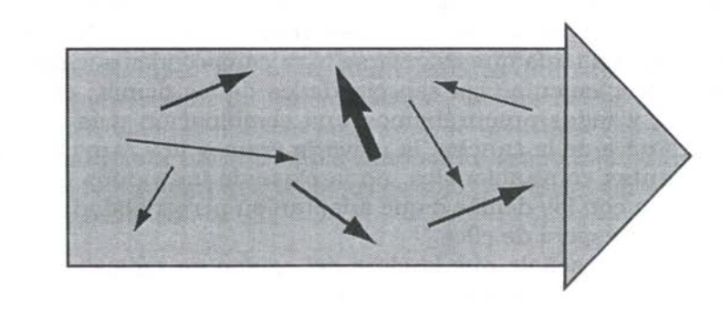

## Capítulo 2: Aprendizaje en equipo

### La capacidad de un equipo

"alineamiento": cuando un grupo de personas funciona como una totalidad.

La característica fundamental de un equipo relativa-
mente no alineado es el desperdicio de energía. Los indivi-
duos pueden poner muchísimo empeño, pero sus esfuerzos
no se traducen eficazmente en una labor de equipo.

El alineamiento es la condición necesaria
para que la potencia del individuo infunda potencia al equipo.

El aprendizaje en equipo es el proceso de alinearse y de-
sarrollar la capacidad de un equipo para crear los resultados
que sus miembros re~mente desean. Se construye sobre la
disciplina de desarrollar una visión compartida. También se
construye sobre el dominio personal, pues los equipos talen-
tosos están constituidos por individuos talentosos. Pero la visión compartida y el talento no son suficientes.

Dimensiones críticas:
- Los equipos deben aprender a explotar el potencial de muchas mentes para ser más inteligentes que una mente sola.
- necesidad de una acción innovadora y coordinada.
- el papel de los miembros del equipo en otros equipos.

Prácticas: diálogo y discusión.

### La disciplina del aprendizaje en equipo

#### Diálogo y discusión

Debe haber una sinergia entre ambos para lograr un aprendizaje generativo contínuo.

La discusión consiste en una conversación sobre un tema de común interés que es analizado desde muchos puntos de vista, pero el objetivo es ganar, lo cual es incompatible con la prioridad de la coherencia y la verdad.

En el diálogo, los individuos obtienen una comprensión que
no se podría obtener individualmente. En el diálogo, sostiene Bohm,
un grupo tiene acceso a una mayor "reserva de significado
común", a la cual no se puede tener acceso individual.

Objetivo del diálogo: revelar incoherencias de nuestro pensamiento. En el diálogo las personas aprenden a observar sus propios pensamientos.

Condiciones para el diálogo:
1. todos los participantes deben "suspender" sus supuestos, literalmente, sostenerlos "como suspendidos ante sí mismos" (someterlos a examen);
1. todos los participantes deben verse como colegas;
2. tiene que haber un "árbitro" que "mantenga el contexto" del diálogo.

3. Equilíbrio entre diálogo y discusión: En un diálogo se explora pero en una discusión se toman decisiones.
4. Rejlexión, indagación y diálogo.

#### Mrontando la "realidad actual": conflicto y rutinas defensivas

Los grandes equipos tienen conflictos acerca de cómo concretar la visión común, lo cual es crucial para el pensamiento creativo.

Las rutinas defensivas (como señalamos en el Capítulo
10, "Modelos mentales") son hábitos arraigados que utiliza-
mos para protegernos del sentimiento de amenaza que surge
cuando exponemos nuestro pensamiento. Las rutinas defen-
sivas forman un caparazón protector alrededor de nuestros
supuestos más hondos, defendiéndonos contra el dolor, pero impidiéndonos aprender sobre las causas de ese dolor.

Cómo enfrentar el proceso de desplazamiento de la carga:
1. Eliminar la amenaza emocional (abrirse)
2. Expresar las rutinas defensivas, ya que sólo funcionan en la medida que no se las conoce

#### El eslabón perdido: la práctica

La ausencia casi total de "prácticas" o "ensayos"
es un factor predominante para impedir que la mayoría de
los equipos de administración sean unidades efectivas.

### Aprendiendo a "practicar"

Sesiones de diálogo arbitrado de cuestiones dificiles.

### El aprendizaje en equipo y la quinta disciplina

Las rutinas defensivas son creaciones mutuas. Sin un lenguaje compartido para abordar la complejidad, el aprendizaje en equipo es limitado.
