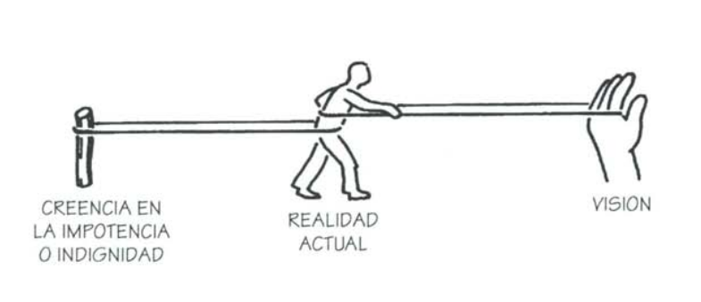

# Tercera Parte. Las disciplinas centrales: construyendo una organización con capacidad de aprendizaje

## Capítulo 9: Domínio personal

### El espíritu de la organización inteligente

Las organizaciones sólo aprenden a través de individuos
que aprenden, El aprendizaje individual no garantiza el
aprendizaje organizacional, pero no hay aprendizaje organi-
zacional sin aprendizaje individual.

Los directivos deben redefinir su tarea. Deben abandonar "el viejo dogma de planificar, organizar y controlar" para comprender "el
carácter casi sagrado de su responsabilidad por la vida de
tantas personas". La tarea fundamental de los directivos, según O'Brien, consiste en "brindar las condiciones que capaciten a la gente para llevar vidas enriquecedoras".

"Dominio personal" es la expresión que mis colegas y yo
usamos para la disciplina del crecimiento y el aprendizaje
personal. La gente con alto nivel de dominio personal expande continuamente su aptitud para crear los resultados que
buscan en la vida. De su búsqueda de aprendizaje continuo
surge el espíritu de la organización inteligente.

### Dominio y destreza

El dominio personal trasciende la competencia y las ha-
bilidades, aunque se basa en ellas. Trasciende la apertura
espiritual, aunque requiere crecimiento espiritual. Significa
abordar la vida como una tarea creativa, vivirla desde una
perspectiva creativa y no meramente reactiva.

El domínio personal encarna 2 movimientos subyacentes:
1. Clarificar continuamente lo que es importante para nosotros (lo que deseamos/visión)
2. Ver con mayor claridad la realidad actual (dónde estamos en relación a dónde queremos estar)

### "Porque lo queremos"

El lider empresarial es lider espiritual, la "moralidad de mercado" no es menor.

Yankelovich ha indicado un "cambio
básico de actitud en el ámbito laboral", que ha pasado de
una perspectiva "instrumental" a una "sagrada" (es decir, que es valorado por si mismo).

Las virtudes de la vida y el éxito en
los negocios no sólo no son incompatibles sino que se enri-
quecen mutuamente. Esto está muy lejos de la tradicional
'moral del mercado''

Hay un compromiso incondicional, un coraje inequívoco, en la postura que adopta una organización realmente
comprometida con el dominio personal. Lo queremos porque
lo queremos.

### Resistencia
Comprometerse con el pleno desarrollo de nuestra vida constituye un abandono radical del contrato tradicional
entre el empleado y la institución.

- Beneficios no medibles
- El cinismo
- Amenaza el status quo

### La disciplina del domínio personal

#### Visión personal
La capacidad para concentrarse en metas intrínsecas relevantes, no sólo en metas secundarias, es una piedra
angular del dominio personal.

Por eso el dominio personal debe ser una disciplina. Es un proceso de focalizarse continuamente, una y otra vez, en lo que uno desea de veras, en
nuestras visiones.

#### Sostener la tensión creativa

Es la brecha entre la visión y la realidad. Es
también una fuente de energía.

Afloja la visión o afloja la realidad?

"Sólo los mediocres están siempre en su forma
óptima"

#### "Conflicto estructural": el poder de la impotencia

Muchos abrigamos un par de creencias contradictorias
que limitan nuestra capacidad para crear lo que de veras
deseamos. La más común es la creencia en nuestra impoten-
cia, nuestra incapacidad para concretar las cosas que nos
interesan. La otra creencia se centra en nuestra indignidad:
no merecemos lo que realmente deseamos.

Concepto de conflicto estructural: este sistema:

Estrategias para superar el conflicto estructural:
- Consentir el desgaste de nuestra visión.
- Manipulación del conflicto: motivación por el miedo.
- Fuerza de voluntad

#### COmpromiso con la verdad

Podemos comenzar con una simplísima pero profunda
estrategia para afrontar el conflicto estructural: decir la verdad.

El compromiso con la verdad significa empeño para extirpar las maneras en que nos limi-
tamos o nos engañamos, impidiéndonos ver lo que existe, y para desafiar continuamente nuestras teorías acerca de por
qué las cosas son como son.

Así, la primera tarea crítica al afrontar conflictos estruc-
turales consiste en reconocerlos, y reconocer la conducta
resultante, cuando están operando. Puede ser muy dificil re-
conocer estas estrategias cuando están actuando.

Por decirlo en términos
religiosos clásicos, sólo a través de la verdad alcanzamos la
gracia.

#### Usando el subconsciente, o: No es necesario entender todo

En la práctica del dominio personal está implícita otra
dimensión de la mente, el subconsciente. A través del sub-
consciente, todos nosotros afrontamos la complejidad. Lo que
distingue a los individuos con mayor nivel de dominio perso-
nal es que ha desarrollado un nivel más elevado de comuni-
cación entre la conciencia normal y el subconsciente. Ellos
enfocan como disciplina aquello que la mayoría damos por
sentado y explotamos al azar.

El subconsciente es crítico para el aprendizaje. A medida que aprendemos las cosas, se desplazan de la atención consciente al control subconsciente.

### El domínio personal y la quinta disciplina

La perspectiva sistémica ilumina los siguientes aspectos:

#### Integración de razón e intuición

Consecuencia natural del dominio persoal: no ignorar la intuición. Mucho del pensamiento sistémico se intuye naturalmente. 

La sinergia de razón e intuición que caracteriza a
casi todos los grandes pensadores.

#### Ver nuestra conexión con el mundo

Al pensar en Ian, comencé a pensar que una dimensión
olvidada del crecimiento personal consiste en "cerrar los ri-
zas", en descubrir continuamente que ciertas fuerzas apa-
rentemente externas están interrelacionadas con nuestros
propios actos.

Ver cada vez más
la interdependencia entre los actos y nuestra realidad.

#### Compasión

La disciplina de ver interrelaciones erosiona gradual-
mente viejas actitudes de acusación y culpa. Comenzamos a
ver que todos nosotros estamos atrapados en estructuras, estructuras encastradas en nuestros modos de pensar y en los
ámbitos interpersonales y sociales donde vivimos.

#### Compromiso con la totalidad

El compromiso genuino es siempre algo mayor que nosotros mismos

### ALENTANDO EL DOMÍNIO PERSONAL EN UNA ORGANIZACIÓN

No se puede obligar a nadie a desarrollar su dominio perso-
nal.

¿Qué pueden hacer los líderes interesados en fomentar
el dominio personal?
Pueden trabajar sin pausa para alentar un clima donde
los principios del dominio personal se practiquen en la vida
cotidiana.
Esto:
1. refuerza constantemente la idea de que el crecimiento personal es valorado de veras en la organización.
2. n la medida en que los individuos responden a lo que se ofrece, brinda un "adiestramiento laboral" que resulta vital para desarrollar el dominio personal.

Muchas de las prácticas más productivas para desarro-
llar dominio personal forman parte de las disciplinas para construir organizaciones inteligentes, organizaciones que aprenden. En muchos sentidos, las acciones más positivas que
una organización puede realizar para alentar el dominio personal implican el desarrollo concertado de las cinco disciplinas de aprendizaje.
