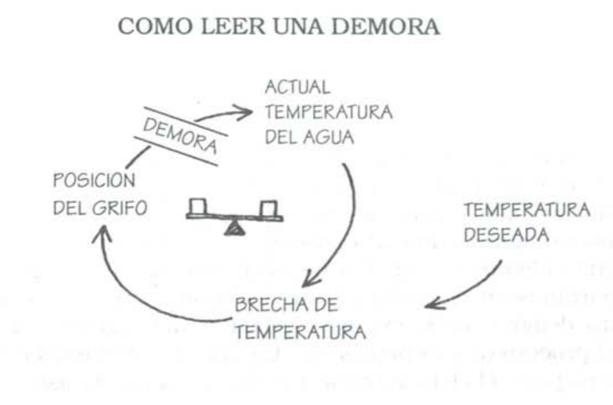
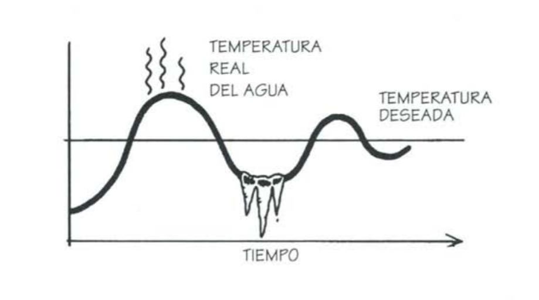
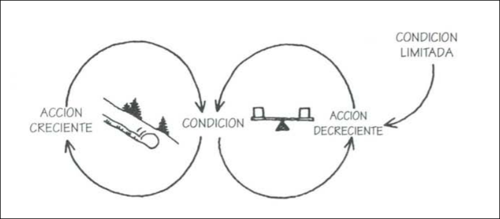
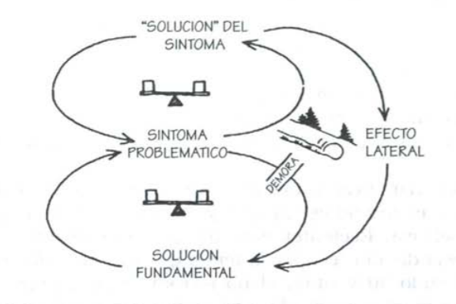
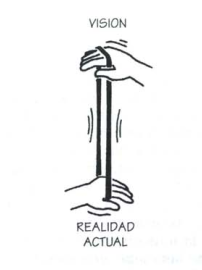
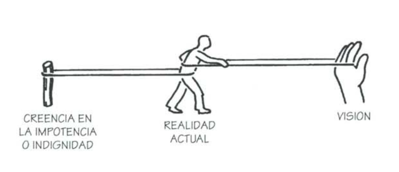
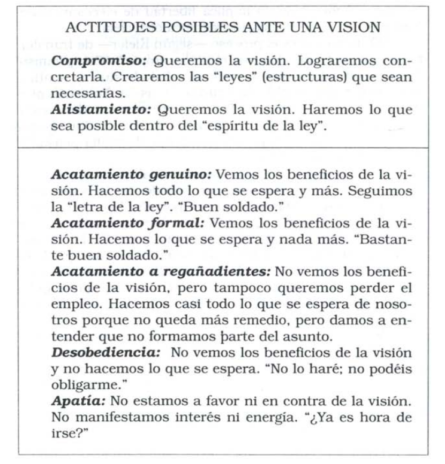
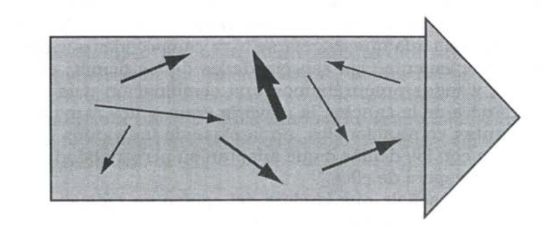

# Resumen de "La quinta disciplina"

## Capítulo 1 (16/5,80m, 16 pag)

Organización inteligente: aquellas donde la gente expande continuamente su aptitud para crear los resultados que desea, donde se cultivan nuevos y expansivos patrones de pensamiento, donde la aspiración colectiva queda en libertad, y donde la gente continuamente aprende a aprender en conjunto

En la organización inteligente/del futuro no alcanza mandar a alguien q aprenda y listo, todos deben comprometerse y aprender.

La diferencia entre la organización de control (autoritaria y tradicional) y la organización inteligente es el domínio de ciertas disciplinas básicas:
- pensamiento sistémico: pensar en el todo en vez de una parte
- domínio personal: aprender constantemente. Una empresa no puede ttener más ganas de aprender que c/u de sus integrantes
- modelos mentales: los modelos mentales son las abstracciones que hacemos del mundo, nuestras suposiciones. Para trabajar con ellos hay que exhumarlos y examinarlos
- Construcción de una visión compartida: la visión realmente es compartida, no unos principios sino que todos son motivados por la identidad y visión de la empresa
- Aprendizaje en equipo: el equipo debe ser más inteligente que cada individuo separado. Diálogo: pulir asperezas constantemente.

El autor dice que copiar otras empresas y hablar de "mejores prácticas" es destructivo porque es como querer ser bueno por copia.

### La quinta disciplina
Es el pensamiento sistémimo. Sin esta, no es posible lo demás.

### Metanoia, un cambio de enfoque
Metanoia= cambio completo de enfoque de todo. Aprendizaje que realmente incorpora conceptos.
Organización inteligente = hace metanoia. El aprendizaje se hace contínuamente, no sólo para sobrevivir.

### Llevando las ideas a la práctica

<Nada>

## Capítulo 2
Las empresas viven menos q ha mitad q una persona. Mueren todo el tiempo porque no aprenden. 

Las 7 barreras para el aprendizaje:
1. "yo soy mi puesto":Cuando las personas de una organización se concentran unicamente en su puesto, no sienten mayor responsabilidad por los resultados que se generan cuando interactúan todas las partes. Más aún, cuando los resultados son decepcionantes, resulta difícil saber por qué. Sólo se puede suponer que "alguien cometió una falla"
2. "El enemigo externo": síndrome del enemigo externo: siempre está afuera. Es una mirada asistémica pq el adentro y el afuera son parte del mismo sistema.
3. La ilusión de hacerse cargo: a menudo la proactividad es reactividad contra un enemigo externo disfrazada. Si nos volvemos más agresivos para luchar contra el enemigo externo, estamos reaccionando. La verdadera proactividad surge de ver cómo luchamos contra nuestros propios problemas.
4. La fijación en los hechos: No hay que concentrarse en los hechos como los cavernícolas (datos fácticos reales experimentales), hay que enfocarse en los hechos lentos y graduales, que son los que nos matan porque no los vemos.
5. La prábola de la rana hervida: No reaccionamos a los cambios/amenazas lentas y graduales sino a cosas abruptas por naturaleza. Lo gradual y que requiere análisis es lo más peligroso pq no lo ves. Tenés que bajarte del frenesí para verlos.
6. La ilusión de que "se aprende con la experiencia": Las decisiones importantes que toma una empresa son muy a largo plazo, más allá de su "horizonte de aprendizaje", es imposible ver las consecuencias y aprender de ellas. 
7. El mito del equipo administrativo:  Los equipos administrativos son débiles y no sirven para tomar decisiones pq agúan todo y se reservan cosas para no tener conflictos entre ellos. Su supuesto rol es modificar la empresa pero no cambian nada porque modificar cosas los haría quedar mal.

### Problemas y disciplinas
Las disciplinas de aprendizaje corrijen estos problemas.

## Capítulo 3

(juego de la cerveza: la vdriación de demanda mata a todos con exceso de inventario)

El primer principio del pensamiento sistémico:
> Cuando pertenecen al mismo sistema, las personas, a pesar de sus diferencias, suelen producir resultados similares.

Existe un comportamiento del sistema, que causa cosas independientemente de lae personas. La culpatno la tienen ni las personas ni el sistema.

### Redefiniendo el margen de influencia

"Causa Raíz"/niveles de análisis/explicaciones:
Estructura sistémica (generativa) -> Patrones de conducta (reflexiva) -> Hechos (reactivo)

Poderosisima -> soluciones a largo plazo -> soluciones a corto plazo

La reflexiva analiza la causa de la reactiva, la generativa de la reflexiva y así.

# segunda parte: La quinta disciplina, piedra angular de la organización inteligente

# Capítulo 4: Las leyes de la quinta disciplina

## 1- Los problemas de hoy derivan de las "soluciones" de ayer

Muchas veces se da eso. Las soluciones que desplazan el problema a otro lugar del sistema son difíciles de detectar porque cambia quien sufre el problema.

## 2- Cuanto más se presiona, más presiona el sistema

"realimentación compensadora": cuanto más nos esforzamos para arreglar el sistema, más esfuerzo se requiere.

## 3- La conducta mejora antes de empeorar

La "realimentación compensadora" siempre implica una tardanza entre la solución y la respuesta del sistema.

## 4- El camino fácil lleva al mismo lugar

Si la solución fuera visible para todos, ya la hubieran encontrado. El síndrome de "aquí se necesita un martillo más grande" es un buen indicador de pensamiento asistémico. Las soluciones conocidas no son.

## 5- La cura puede ser peor que la enfermedad

"Desplazamiento de la carga": las soluciones asistémicas se vuelven "adictivas" para el sistema; necesarias a largo plazo.

Toda solución a largo plazo debe "fortalecer la aptitud del sistema de sobrellevar las propias cargas".

## 6- Lo más rápido es lo más lento

Los sistemas tienen su ritmo óptimo de crecimiento/cambio. Hacer las cosas demasiado rápido puede hacer peligrar el sistema.

## 7- La causa y el efecto no están próximos en el tiempo y el espacio
<nada>

## 8- Los cambios pequeños pueden producir resultados grandes, pero las zonas de mayor apalancamiento a menudo son las menos obvias

"princípio de la palanca": con poco esfuerzo grandes cambios. Gralmente las zonas de apalancamiento están lejos en el tiempo y espacio. Es necesario conocer muy bien el sistema para descubrirlos. 

## 9- se pueden alcanzar 2 metas aparentemente contradictorias 

Cuando tengo 2 objetivos contradictorios, creo que son contradictorios por pensar en "instantáneas". Si pensara en los procesos de cambio, entendería que se puede uno focalizar en una meta y alcanzar la otra lentamente a lo largo del tiempo.

## 10- Dividir un elefante por la mitad no genera 2 elefantes pequeños.

No siempre es posible estudiar sólo una parte del sistema para comprender el problema. El límite de lo que hay que estudiar ("límite del sistema") es el límite de los procesos que intervienen en el problema.

## 11- no hay culpa

El pensamiento sistémico demuestra que no hay enemigo externo: nosotros y la causa de nuestros problemas formamos parte de un solo sistema. La cura radica en la relación con nuestro "enemigo"

# Capítulo 5: un cambio de enfoque

## Ver el mundo de nuevo

El pensamiento sistémico es una disciplina para ver las "estructuras" que subyacen a las situaciones complejas, y para discernir cambios de alto y bajo apalancamiento. El pensamiento sistémico ofrece un lenguaje que comienza con la reestructuración de nuestro pensamiento.

Hay 2 tipos de complejidad: 
- complejidad de los detalles (los sistemas/simulaciones de las empresas modelan esto)
- complejidad dinámica (situaciones donde la causa y efecto son sutiles, y donde los efectos de la intervención a través del tiempo no son obvios)

Los "análisis de sistemas" se suelen concentrar en la complejidad de detalles, no en la complejidad dinámica. 

La escencia de la disciplina del pensamiento sistémico radica en un cambio de enfoque:
- ver las interrelaciones en vez de las concatenaciones lineales de causa-efecto; y
- ver procesos de cambio en vez de "instantáneas"

Hay que aprender a reconocer "estructuras" iecurrentes y mecanismos de feedback. 

## Círculos de causalidad

La realidad está compuesta de círculos (procesos de realimentación) pero vemos líneas rectas. 

SCREENSHOT PAGS 101 Y 102 MUY IMPORTANTE.

Perspectiva sistémica: menos antropocentrismo: Desde la perspectiva sistémica, el actor humano forma parte del proceso de realimentación, no está separado de él. Esto representa un profundo cambio de concsiencia.

Si todo es circular, no hay chivos expiatorios, sólo gente que puede hacer más o menos apalancamiento. Todos comparten responsabilidad de los problemas.
## Refuerzo y equilibrio de la realimentación y las demoras: los ladrillos deh pensamiento sistémico

2 tipos de procesos de realimentación: 
1. Reforzadora: el tema se potencia
2. Compensadora o estabilizadora: conducta hacia las metas.

Demoras: interrupciones en el flujo de influencia que hacen surgir gradualmente consecuencias. 

### Realimentación reforzadora: cómo crecen los cambios pequeños

Bola de nieve: una pequeña diferencia termina generando un cambio todavía mayor. Puede ser negativo o positivo (círculo virtuoso o vicioso).

Se aceleran rápidamente.

### Procesos compensadores: estabilidad y resistencia

Es un proceso que tiende a no permitir una variación, y que de a poco la compensa, para volver al estado anterior. Resistencia al cambio = procesos compensadores ocultos. Hacer más presión no sirve, hay que encontrar una solución distinta.

### Demoras: la clave es "finalmente"

Cuando el efecto de una variable sobre otra lleva tiempo provoca demotas. Casi todos los procesos de realimentación tienen alguna forma de demora, pero a menudo no se identifican o no se comprenden, llevando a excesos.

La demora genera esto (rizo compensador con demora): oscilación.

También existe en procesos reforzadores.

## Capítulo 6: Configuraciones naturales: Patrones que controlan acontecimientos

Estructuras cuya existencia ignoramos nos retienen
prisioneros. Inversamente, al aprender a ver las estructuras
dentro de las cuales operamos, activamos un proceso de liberación respecto de fuerzas antes invisibles y adquirimos
capacidad para trabajar con ellas y modificarlas.

"Arquetippos sistémicos" o "estructuras genéricas": patrones estructurales recurrentes.

### Arquetipo 1: Límites del crecimiento

#### Definición

Un proceso reforzador (amplificador) se pone en marcha
para producir un resultado deseado. Crea una espiral de éxito pero también genera efectos secundarios inadvertidos
(manifestados en un proceso compensador) que eventualmente atentan contra el éxito.

#### Principio administrativo

No precipites el crecimiento; elimina los factores que limitan el crecimiento.

#### Estructura

En los casos de límites del crecimiento, hay un proceso
reforzador (amplificador) de crecimiento o perfeccionamiento
que opera por sí mismo durante un tiempo. Luego se topa
con un proceso compensador (estabilizador), que opera para
limitar el crecimiento. Cuando eso ocurre, la tasa de perfeccionamiento disminuye e incluso se detiene.

#### Patrón de conducta

Primero se crece/mejora y luego se queda fijo, de repente deja de crecer/mejorar.

#### Cómo aplicar la palanca

La mayoría de la gente reacciona ante las situaciones de
límites del crecimiento presionando más. Pero la solución está en el rizo estabilizador: Para cambiar la conducta del sistema, hay que identificar y modificar el factor limitativo.

Pero siempre hay más trabas al crecimiento: La lección fundamental es que el crecimiento eventualmente se detiene. Los esfuerzos para extender el crecimiento
mediante la eliminación de los limites pueden ser contraproducentes porque postergan lo inevitable; el día fatal.

### ARQUETIPO 2: DESPLAZAMIENTO DE LA CARGA

#### Definición

Un problema subyacente genera problemas que reclaman atención. Pero el problema subyacente es difícil de
abordar, porque es engorroso o porque es costoso afrontarlo.
Así que la gente "desplaza la carga" del problema a otras soluciones, arreglos bien intencionados y fáciles que parecen
muy eficaces. Lamentablemente, las "soluciones" fáciles sólo
aplacan los síntomas y dejan intacto el problema subyacente. El problema subyacente empeora, inadvertido porque los
síntomas aparentemente desaparecen, y el sistema pierde toda capacidad para resolver el problema subyacente.

#### Principio administrativo

No solucione los síntomas. Las soluciones que abordan
los síntomas y no las causas fundamentales del problema a
lo sumo brindan beneficios de corto plazo. Eventualmente el
problema resurge y crece la presión por una respuesta ante
el síntoma. Entretanto, la capacidad para dar soluciones
fundamentales se puede atrofiar.

#### Estructura

Compuesta por 2 procesos compensadores. Uno es la intervención contra el síntoma ("solución rápida"). El otro tiene una demora y representa la respuesta más fundamental ante el problema, cuyos efectos tardan más en evidenciarse.

A menudo (aunque no siempre), en estas estructuras
hay también un proceso reforzador (amplificador) creado por
"efectos laterales" de la solución del síntoma. Cuando esto
ocurre, los efectos laterales dificultan aún más la implementación de la solución fundamental.

#### Comprensión y uso de la estructura

Esta estructura explica una amplia gama de conductas
donde las "soluciones" bien intencionadas empeoran las cosas en el largo plazo.

Un caso especial de esta estructura, que se repite con
alarmante frecuencia, es el de "erosión de las metas". Cuando hay una brecha entre nuestras metas y nuestra situación
actual, hay dos conjuntos de presiones: mejorar la situación y reducir nuestras metas.

#### Cómo aplicar la palanca

Para afrontar una estructura de "desplazamiento de la carga" se requiere fortalecer la respuesta fundamental al tiempo
que se debilita la respuesta sintomática. 

#### COMO CREAR NUESTRA PROPIA HISTORIA DE "DESPLAZAMIENTO DE LA CARGA"

La presencia de una estructura de este tipo ofrece
tres indicios. Primero, hay un problema que empeora
gradualmente en el largo plazo, aunque en ocasiones
parece mejorar por un tiempo. Segundo, la salud general del sistema empeora gradualmente. Tercero, hay
una creciente sensación de impotencia. Las personas se
sienten eufóricas al principio (¡han resuelto el problema!) pero al final se sienten como víctimas.

La percepción primaria de la estructura vendrá de (1)
distinguir diversos tipos de soluciones; (2) ver cómo la
dependencia respecto de soluciones sintomáticas puede
generar más dependencia. El apalancamiento siempre
consistirá en fortalecer el círculo inferior y/o debilitar el
círculo superior.

## Capítulo 7: El principio de la palanca

La clave del pensamiento sistémico es la palanca: hallar
el punto donde los actos y modificaciones en estructuras
pueden conducir a mejoras significativas y duraderas. A me-
nudo la palanca sigue el principio de la economía de medios,
buscando el lugar donde los mejores resultados no provienen
de esfuerzos en gran escala sino de actos pequeños y bien fo-
calizados. El pensamiento asistémico resulta peIjudicial por-
que nos induce a efectuar cambios de bajo apalancamiento:
nos concentramos en los síntomas donde la tensión es ma-
yor y reparamos o aliviamos los síntomas. Pero esos esfuer-
zos mejoran la situación en el corto plazo, a lo sumo, y la
empeoran en el largo plazo.

### Estructura de crecimiento y subinversión

Es cuando una empresa limita su propio crecimiento mediante la subinversión. Funciona muy lento (rana hervida), combina desplazamiento de la carga (emparchar con soluciones truchas la subinversión) con el de límites de crecimiento. El problema es la subinversión, donde hay que apalancar.

## Capítulo 8: El arte de ver los árboles sin dejar de ver el bosque.

no de los mayores beneficios del pensamiento sistémi-
co consiste en ayudarnos a distinguir entre cambios de bajo
y alto apalancamiento en situaciones complejas. El arte del
pensamiento sistémico consiste en ver a través de la comple-
jidad las estructuras subyacentes que generan el cambio.
Pensamiento sistémico no significa ignorar la complejidad,
sino organizar la complejidad en una exposición coherente
que ilumine las causas de los problemas y el modo de remediarlos de forma duradera.a creciente complejidad del
mundo actual induce a muchos managers a suponer que ca-
recen de la información necesaria para actuar con eficacia.
Yo sugiero que en este sentido el problema fundamental no
es la información escasa sino la información excesiva. Nece-
sitamos distinguir lo importante de lo irrelevante, las varia-
bles decisivas de las secundarias, y necesitamos hacerlo de
modo que ayude a los grupos o equipos a desarrollar una
comprensión compartida.

### Los peligros de ser pionero (el caso de People Express Airlines)

La creencia de que había un "enemigo externo" impidió
a los ejecutivos de People Express ver las contradicciones de
sus propias políticas y estrategias. La compañía introdujo
ideas muy innovadoras en sus políticas de recursos huma-
nos. pero también trató de alcanzar un puesto dominante en
la industria en pocos años. Ambas metas eran inherente-
mente contradictorias.

En consecuencia. la aerolínea cayó en un círculo vicioso
de subinversión y erosión de calidad (tanto para clientes co-
mo para empleados) que atentaba contra sus dignos ideales
en materia de equipo y servicio a la clientela.

# Tercera Parte. Las disciplinas centrales: construyendo una organización con capacidad de aprendizaje

## Capítulo 9: Domínio personal

### El espíritu de la organización inteligente

Las organizaciones sólo aprenden a través de individuos
que aprenden, El aprendizaje individual no garantiza el
aprendizaje organizacional, pero no hay aprendizaje organi-
zacional sin aprendizaje individual.

Los directivos deben redefinir su tarea. Deben abandonar "el viejo dogma de planificar, organizar y controlar" para comprender "el
carácter casi sagrado de su responsabilidad por la vida de
tantas personas". La tarea fundamental de los directivos, según O'Brien, consiste en "brindar las condiciones que capaciten a la gente para llevar vidas enriquecedoras".

"Dominio personal" es la expresión que mis colegas y yo
usamos para la disciplina del crecimiento y el aprendizaje
personal. La gente con alto nivel de dominio personal expande continuamente su aptitud para crear los resultados que
buscan en la vida. De su búsqueda de aprendizaje continuo
surge el espíritu de la organización inteligente.

### Dominio y destreza

El dominio personal trasciende la competencia y las ha-
bilidades, aunque se basa en ellas. Trasciende la apertura
espiritual, aunque requiere crecimiento espiritual. Significa
abordar la vida como una tarea creativa, vivirla desde una
perspectiva creativa y no meramente reactiva.

El domínio personal encarna 2 movimientos subyacentes:
1. Clarificar continuamente lo que es importante para nosotros (lo que deseamos/visión)
2. Ver con mayor claridad la realidad actual (dónde estamos en relación a dónde queremos estar)

### "Porque lo queremos"

El lider empresarial es lider espiritual, la "moralidad de mercado" no es menor.

Yankelovich ha indicado un "cambio
básico de actitud en el ámbito laboral", que ha pasado de
una perspectiva "instrumental" a una "sagrada" (es decir, que es valorado por si mismo).

Las virtudes de la vida y el éxito en
los negocios no sólo no son incompatibles sino que se enri-
quecen mutuamente. Esto está muy lejos de la tradicional
'moral del mercado''

Hay un compromiso incondicional, un coraje inequívoco, en la postura que adopta una organización realmente
comprometida con el dominio personal. Lo queremos porque
lo queremos.

### Resistencia
Comprometerse con el pleno desarrollo de nuestra vida constituye un abandono radical del contrato tradicional
entre el empleado y la institución.

- Beneficios no medibles
- El cinismo
- Amenaza el status quo

### La disciplina del domínio personal

#### Visión personal
La capacidad para concentrarse en metas intrínsecas relevantes, no sólo en metas secundarias, es una piedra
angular del dominio personal.

Por eso el dominio personal debe ser una disciplina. Es un proceso de focalizarse continuamente, una y otra vez, en lo que uno desea de veras, en
nuestras visiones.

#### Sostener la tensión creativa

Es la brecha entre la visión y la realidad. Es
también una fuente de energía.

Afloja la visión o afloja la realidad?

"Sólo los mediocres están siempre en su forma
óptima"

#### "Conflicto estructural": el poder de la impotencia

Muchos abrigamos un par de creencias contradictorias
que limitan nuestra capacidad para crear lo que de veras
deseamos. La más común es la creencia en nuestra impoten-
cia, nuestra incapacidad para concretar las cosas que nos
interesan. La otra creencia se centra en nuestra indignidad:
no merecemos lo que realmente deseamos.

Concepto de conflicto estructural: este sistema:

Estrategias para superar el conflicto estructural:
- Consentir el desgaste de nuestra visión.
- Manipulación del conflicto: motivación por el miedo.
- Fuerza de voluntad

#### COmpromiso con la verdad

Podemos comenzar con una simplísima pero profunda
estrategia para afrontar el conflicto estructural: decir la verdad.

El compromiso con la verdad significa empeño para extirpar las maneras en que nos limi-
tamos o nos engañamos, impidiéndonos ver lo que existe, y para desafiar continuamente nuestras teorías acerca de por
qué las cosas son como son.

Así, la primera tarea crítica al afrontar conflictos estruc-
turales consiste en reconocerlos, y reconocer la conducta
resultante, cuando están operando. Puede ser muy dificil re-
conocer estas estrategias cuando están actuando.

Por decirlo en términos
religiosos clásicos, sólo a través de la verdad alcanzamos la
gracia.

#### Usando el subconsciente, o: No es necesario entender todo

En la práctica del dominio personal está implícita otra
dimensión de la mente, el subconsciente. A través del sub-
consciente, todos nosotros afrontamos la complejidad. Lo que
distingue a los individuos con mayor nivel de dominio perso-
nal es que ha desarrollado un nivel más elevado de comuni-
cación entre la conciencia normal y el subconsciente. Ellos
enfocan como disciplina aquello que la mayoría damos por
sentado y explotamos al azar.

El subconsciente es crítico para el aprendizaje. A medida que aprendemos las cosas, se desplazan de la atención consciente al control subconsciente.

### El domínio personal y la quinta disciplina

La perspectiva sistémica ilumina los siguientes aspectos:

#### Integración de razón e intuición

Consecuencia natural del dominio persoal: no ignorar la intuición. Mucho del pensamiento sistémico se intuye naturalmente. 

La sinergia de razón e intuición que caracteriza a
casi todos los grandes pensadores.

#### Ver nuestra conexión con el mundo

Al pensar en Ian, comencé a pensar que una dimensión
olvidada del crecimiento personal consiste en "cerrar los ri-
zas", en descubrir continuamente que ciertas fuerzas apa-
rentemente externas están interrelacionadas con nuestros
propios actos.

Ver cada vez más
la interdependencia entre los actos y nuestra realidad.

#### Compasión

La disciplina de ver interrelaciones erosiona gradual-
mente viejas actitudes de acusación y culpa. Comenzamos a
ver que todos nosotros estamos atrapados en estructuras, estructuras encastradas en nuestros modos de pensar y en los
ámbitos interpersonales y sociales donde vivimos.

#### Compromiso con la totalidad

El compromiso genuino es siempre algo mayor que nosotros mismos

### ALENTANDO EL DOMÍNIO PERSONAL EN UNA ORGANIZACIÓN

No se puede obligar a nadie a desarrollar su dominio perso-
nal.

¿Qué pueden hacer los líderes interesados en fomentar
el dominio personal?
Pueden trabajar sin pausa para alentar un clima donde
los principios del dominio personal se practiquen en la vida
cotidiana.
Esto:
1. refuerza constantemente la idea de que el crecimiento personal es valorado de veras en la organización.
2. n la medida en que los individuos responden a lo que se ofrece, brinda un "adiestramiento laboral" que resulta vital para desarrollar el dominio personal.

Muchas de las prácticas más productivas para desarro-
llar dominio personal forman parte de las disciplinas para construir organizaciones inteligentes, organizaciones que aprenden. En muchos sentidos, las acciones más positivas que
una organización puede realizar para alentar el dominio personal implican el desarrollo concertado de las cinco disciplinas de aprendizaje.

## Capítulo 10: Modelos mentales

### Por qué fracasan las mejores ideas

Por culpa de los modelos mentales: profundas imágenes internas acerca del funcionamiento del mundo.

"Aunque las personas no
[siempre] se comportan en congruencia con las teorías que
abrazan [lo que dicen], sí se comportan en congruencia con
sus teorías-en-uso [los modelos mentales]"

Son activos: moldean nuestros actos. Afectan lo que hacemos porque afectan lo que vemos.

Por definición, todos los modelos
son simplificaciones. El problema surge cuando los modelos
mentales son tácitos... Al no tener conciencia de sus modelos mentales, no se los examina. Entonces, al cambiar el mundo, fuiste.

La inercia de los modelos mentales profundamente
arraigados puede sofocar aun los mejores conceptos sistémicos. 

### Una nueva perspectiva de los negocios

<cómo shell manipuló modelos mentales para que los managers crean que se venía la crisis del petróleo y tuvo éxito cuando se vino (hicieron un modelo que mostrara que si se daban todos sus supuestos, era un cuento de hadas). >

### Las enfermedades básicas de la jerarquía

Cómo combatirlos:
- Apertura: para arreglar "la enfermedad farsesca que dominaba la conducta de la gente en las reuniones. Nadie describía un problema a las diez de la mañana en una reunión de negocios de la misma manera en que lo describía a las siete de la noche, en casa o bebiendo con los amigos"
- Mérito (tomar decisiones solamente basadas en los mejores intereses de la organización): para arreglar: "decisiones basadas en una política burocrática cuya regla de juego es crear una impresión favorable para progresar"

Aptitudes de modelos mentales:
- El reconocimiento de "brincos de abstracción" (reparar en nuestros saltos de la observación a la generalización);
- Exponer la "columna izquierda" (manifestar lo que nor-
malmente callamos);
- Equilibrar la indagación con la persuasión (aptitudes para una investigación honesta);
- Enfrentar los distingos entre las teorías expuestas (lo que decimos) y las teorías-en-uso (la teoría implícita de lo que hacemos).

### La disciplina de los modelos mentales

Tareas críticas para trabajar con modelos mentales: 

- llevar a la superficie supuestos básicos acerca de importantes cuestiones de negocios.
- desarrollar aptitudes de aprendizaje "cara a cara"

#### La "planificación como aprendizaje" y los "directorios internos": administrando los modelos mentales en una organización

La institucionalización del examen de los modelos mentales requiere mecanismos que vuelvan ineludible esta práctica 
- la presentación de la planificación tradicional como aprendizaje
- la creación de "directorios internos" para reunir regularmente a los directivos superiores y locales, con el objeto de refinar los pensamientos que respaldan las decisiones locales.

#### Reflexión e indagación: los modelos mentales en niveles personales e interpersonales

Las aptitudes de aprendizaje de los especialistas en
"ciencia de la acción" como Chris Argyris se dividen en dos
clases amplias: aptitudes para la reflexión y aptitudes para
la indagación. Las primeras se relacionan con desacelerar
nuestros procesos de pensamiento para cobrar mayor conciencia de cómo formamos nuestros modelos mentales y cómo éstos influyen sobre nuestros actos. Las segundas conciernen a nuestro modo de operar en interacciones directas
con los demás, sobre todo cuando abordamos temas complejos y conflictivos.

##### Brincos de abstracción

Generalizamos rapidísimo (brinco = generalización), lo cual no nos permite aprender rápido. Lo peligroso es que pueden volverse casi axiomáticos y armar castillos en el aire.

¿Cómo se localizan los brincos de abstracción? Primero,
preguntándonos qué creemos sobre el modo en que funciona
el mundo: la naturaleza de los negocios, la gente en general,
los individuos específicos. Pregúntese: "¿Cuáles son los 'da-
tos' sobre los cuales se basa esta generalización?" Luego pre-
gúntese: "¿Estoy dispuesto a considerar que esta generaliza-
ción puede ser inexacta o equívoca?" Es importante hacerse esta segunda pregunta a conciencia, porque si la respuesta
es negativa no tiene caso continuar.

##### Columna izquierda

Esta es una técnica poderosa para
"ver" cómo operan nuestros modelos mentales en situaciones
particulares. Revela cómo manipulamos las situaciones para
no afrontar nuestros verdaderos sentimientos y pensamien-
tos, con lo cual obstaculizamos la corrección de una situa-
ción contraproducente.

Columna derecha: el diálogo que se da.
Columna izquierda: lo que pienso.

##### Equilibrio entre la indagación y la persuasión.

El aprendizaje más productivo habitualmente se pro-
duce cuando los gerentes combinan la indagación con la
persuasión, algo que también denominamos "indagación re-
cíproca". Queremos decir que cada cual explicita su pensa-
miento y lo somete al examen público. Esto crea una atmós-
fera de genuina vulnerabilidad. Nadie oculta las pruebas ni
los razonamientos que respaldan su punto de vista; es decir,
nadie los expone sin dejarlos abiertos al escrutinio. Por ejem-
plo, cuando la indagación y la persuasión están equilibra-
das, no sólo indagamos el razonamiento que respalda los
puntos de vista ajenos sino que exponemos los nuestros de
tal modo que revelamos nuestros supuestos y razonamientos
invitando a los demás a que los indaguen. Podemos decir:
"He aquÍ mi opinión y he aquÍ cómo he llegado a ella. ¿Qué
os parece?"

cuando se combinan la persuasión y la indagación,
estamos dispuestos a confirmar datos y a refutarlos, porque
estamos genuinamente interesados en hallar los defectos de
nuestra perspectiva. Asimismo, exponemos nuestro razona-
miento y buscamos sus fallos, y tratamos de comprender el
razonamiento de otros.

Persuasión pura: no produce aprendizaje, sólo convence.
Indagación pura: oculta los modelos mentales propios.

##### Teoría expuesta y teoría-en-uso

El aprendizaje eventualmente deriva en cambios en la acción, y no consiste sólo en
absorber nueva información y formar nuevas "ideas". Por eso
es vital reconocer la brecha entre las teorías que guían (lo
que decimos) y nuestras teorías-en-uso (las teorías que justifican nuestros actos). De lo contrario, podemos creer que hemos "aprendido" algo sólo porque adoptamos un lenguaje o
conceptos nuevos, aunque nuestra conducta no se haya modificado.

El problema no está en la
brecha (tensión creativa) sino en no decir la verdad sobre esa brecha. Mientras
no reconozca la brecha entre mi teoría expuesta y mi con-
ducta real, no puede haber aprendizaje.

### LOS MODELOS MENTALES Y LA QUINTA DISCIPLINA

Como mostramos al principio de este capítulo, los modelos mentales arraigados frenan los cambios que podrían
derivar del pensamiento sistémico.

## Capítulo 11: Visión compartida 

### Un interés común

Una visión compartida no es una idea. Es una fuerza en
el corazón de la gente, una fuerza de impresionante poder.

Puede estar inspirada por una idea, pero si es tan convin-
cente como para lograr el respaldo de más de una persona
cesa de ser una abstracción. Es palpable. La gente comienza
a verla como si existiera. Pocas fuerzas humanas son tan po-
derosas como una visión compartida.

una visión compartida es la res-
puesta a la pregunta: "¿Qué deseamos crear?"

### POR QUE IMPORTAN LAS VISIONES COMPARTIDAS

Las visiones compartidas apelan tan naturalmente al
coraje que la gente ni siquiera repara en la dimensión de ese
coraje. Coraje consiste simplemente en hacer lo que se nece-
sita para alcanzar una visión.

No hay organización inteligente sin visión compartida.

La visión compartida alienta la experimentación y el de-
seo de correr riesgos.

La visión compartida alienta el compromiso con el largo plazo. Quizá no sea posible convencer racionalmente a los seres hu-
manos de adoptar una perspectiva de largo plazo.

### La disciplina de construir una visión compartida

#### Alentando la visión personal

Las visiones compartidas surgen de visiones personales.
Así es como obtienen su energía y alientan el compromiso. "Mi visión no es im-
portante para ti. La única visión que te motiva es la tuya"

Las organizaciones que procuran desarrollar visiones
compartidas alientan a los miembros a desarrollar sus visio-
nes personales. Si la gente no tiene una visión propia, a lo
sumo "suscribirá" la visión de otro. El resultado es el acata-
miento, nunca el compromiso.

#### De las visiones compartidas a las visiones personales

Cada visión individual del todo es única. Todos tenemos nuestro propio modo de aprehender la visión más amplia.

Tradicionalmente la visión se la impone desde arriba y no es compartida. Se usa solamente para tomar decisiones estratégicas. Esa visión no sirve para nada porque no es compartida.

Para quienes ocupan puestos de liderazgo, lo más im-
portante es recordar que sus visiones siguen siendo persona-
les. El hecho de que ellos ocupen puestos de liderazgo no
significa que sus visiones personales constituyan automáti-
camente "la visión de la organización"

En Digital construyeron una visión compartida de a poco, originada desde abajo, el tipo se dio la vuelta a la empresa promoviendo y refinando esa visión con feedback.

Las visiones compartidas tardan en emerger. Crecen co-
mo subproducto de interacciones de visiones individuales.

Debemos permitir que coexistan
múltiples visiones, escuchando para sintonizar el rumbo ati-
nado, el cual trasciende y unifica todas las visiones individuales.

#### Difusión de las visiones: alistamiento, compromiso y acatamiento

Las organizaciones tradicionales no se interesaban en el
alistamiento y el compromiso. La jerarquía de comando y
control sólo requería acatamiento.

#### Sugerencias para el alistamiento y el compromiso

- Alístese usted mismo: no venda la visión, vívala.
- Sea franco: no exagere ni oculte sobre la visión.
- Deje que la persona elija: no convenza.

No se puede hacer nada para lograr que otra persona se aliste o se comprometa: requieren libertad de elección. A lo sumo se podrá lograr acatamiento por medio de la imposición.

#### Anclando la visión a un conjunto de ideas rectoras

Ideas rectoras = visión,propósito, valores = *En qué creemos*.

- Visión = *qué*, la imagen de futuro que queremos crear.
- Propósito = *por qué*: la rta de la organización a  "¿por qué existimos?"
- Valores centrales = *Cómo queremos actuar*: describen la vida cotidiana al seguir la visión.

#### Visión positiva y visión negativa

Visión negativa = lo que no queremos, gralmente defensiva.
- desgaste de energía en impedir en vez de construir
- sutil mensaje de impotencia
- corto plazo

Origenes de la motivación:
temor (visiones negativas) vs aspiración (visiones positivas)

#### Tensión creativa y compromiso con la verdad

Una organización inteligente no se caracteriza por visiones
etéreas sino por la implacable voluntad de examinar "lo exis-
tente" a la luz de una visión.

### La visión compartida y la quinta disciplina

#### Por qué las visiones mueren prematuramente

Las visiones se propagan a causa de un proceso reforza-
dor de creciente claridad, entusiasmo, comunicación y com-
promiso. A medida que la gente habla, las visiones cobran
nitidez. A medida que cobran nitidez, crece el entusiasmo.

Si la visión es polarizante, la gente con perspectivas diferentes le parece mala la visión y la "desenfoca". Para que no pase eso la organización debe tener la habilidad **reflexión e indagación**. El proceso visionario es un tipo de proces de indagación (del futuro que queremos crear).

el dominio personal es el "cimiento" de una visión
compartida: las organizaciones que no alientan el dominio
personal tienen dificultades para fomentar el compromiso
sostenido con una visión elevada.

#### La sinergia faltante: la visión compartida y el pensamiento sistémico

cuando la gente de una organización comienza a
aprender que crea la realidad mediante sus políticas y acciones, se gana un terreno nuevo y más fértil para las visiones.

## Capítulo 2: Aprendizaje en equipo

### La capacidad de un equipo

"alineamiento": cuando un grupo de personas funciona como una totalidad.

La característica fundamental de un equipo relativa-
mente no alineado es el desperdicio de energía. Los indivi-
duos pueden poner muchísimo empeño, pero sus esfuerzos
no se traducen eficazmente en una labor de equipo.

El alineamiento es la condición necesaria
para que la potencia del individuo infunda potencia al equipo.

El aprendizaje en equipo es el proceso de alinearse y de-
sarrollar la capacidad de un equipo para crear los resultados
que sus miembros re~mente desean. Se construye sobre la
disciplina de desarrollar una visión compartida. También se
construye sobre el dominio personal, pues los equipos talen-
tosos están constituidos por individuos talentosos. Pero la visión compartida y el talento no son suficientes.

Dimensiones críticas:
- Los equipos deben aprender a explotar el potencial de muchas mentes para ser más inteligentes que una mente sola.
- necesidad de una acción innovadora y coordinada.
- el papel de los miembros del equipo en otros equipos.

Prácticas: diálogo y discusión.

### La disciplina del aprendizaje en equipo

#### Diálogo y discusión

Debe haber una sinergia entre ambos para lograr un aprendizaje generativo contínuo.

La discusión consiste en una conversación sobre un tema de común interés que es analizado desde muchos puntos de vista, pero el objetivo es ganar, lo cual es incompatible con la prioridad de la coherencia y la verdad.

En el diálogo, los individuos obtienen una comprensión que
no se podría obtener individualmente. En el diálogo, sostiene Bohm,
un grupo tiene acceso a una mayor "reserva de significado
común", a la cual no se puede tener acceso individual.

Objetivo del diálogo: revelar incoherencias de nuestro pensamiento. En el diálogo las personas aprenden a observar sus propios pensamientos.

Condiciones para el diálogo:
1. todos los participantes deben "suspender" sus supuestos, literalmente, sostenerlos "como suspendidos ante sí mismos" (someterlos a examen);
1. todos los participantes deben verse como colegas;
2. tiene que haber un "árbitro" que "mantenga el contexto" del diálogo.

3. Equilíbrio entre diálogo y discusión: En un diálogo se explora pero en una discusión se toman decisiones.
4. Rejlexión, indagación y diálogo.

#### Mrontando la "realidad actual": conflicto y rutinas defensivas

Los grandes equipos tienen conflictos acerca de cómo concretar la visión común, lo cual es crucial para el pensamiento creativo.

Las rutinas defensivas (como señalamos en el Capítulo
10, "Modelos mentales") son hábitos arraigados que utiliza-
mos para protegernos del sentimiento de amenaza que surge
cuando exponemos nuestro pensamiento. Las rutinas defen-
sivas forman un caparazón protector alrededor de nuestros
supuestos más hondos, defendiéndonos contra el dolor, pero impidiéndonos aprender sobre las causas de ese dolor.

Cómo enfrentar el proceso de desplazamiento de la carga:
1. Eliminar la amenaza emocional (abrirse)
2. Expresar las rutinas defensivas, ya que sólo funcionan en la medida que no se las conoce

#### El eslabón perdido: la práctica

La ausencia casi total de "prácticas" o "ensayos"
es un factor predominante para impedir que la mayoría de
los equipos de administración sean unidades efectivas.

### Aprendiendo a "practicar"

Sesiones de diálogo arbitrado de cuestiones dificiles.

### El aprendizaje en equipo y la quinta disciplina

Las rutinas defensivas son creaciones mutuas. Sin un lenguaje compartido para abordar la complejidad, el aprendizaje en equipo es limitado.

# Cuarta parte: Prototipos

## Capítulo 13: Apertura

### ¿Cómo superar el politiqueo interno que predomina en las organizaciones tradicionales?

Un "ámbito político" es aquel donde el "quién" es más
importante que el "qué". Siempre hay "ganadores" y "perdedores", gente que
acumula poder y gente que pierde poder. El poder se concen-
tra y se esgrime arbitrariamente.

La construcción de una visión compartida es el primer
paso para desafiar las maniobras de política interna. Sin una
visión y valores comunes que sean genuinos, nada puede
arrancar a la gente del egoísmo.

La visión y la apertura constituyen los antídotos contra las maniobras políticas internas.

### Visión compartida: cómo construir un ámbito donde no predomine el interés personal

Profecía autocumplida: quienes practican el liderazgo
político "creen que las personas están motivadas por intere-
ses personales y la búsqueda de poder y riqueza". 

Compartir las visiones personales ayuda a derrumbar el politiqueo.

### Apertura participativa y apertura reflexiva

Hay que integrar ambas actitudes.

Apertura participativa: emitir tu opinión. "El supuesto implícito es que la
solución de todos nuestros problemas consiste en manifestar
nuestros puntos de vista".

Apertura reflexiva:  autoexaminarse.

Puede darse un desplazamiento de la carga o una sinergia entre "aperturas".

### Apertura y complejidad

Nuestro pensamiento es autoritario por nuestra educación. En
el fondo estamos convencidos de que la gente de arriba sabe
qué está pasando, o que debiera saberlo si es competente.
Esta mentalidad nos debilita como individuos, y debilita a la
organización como conjunto. En cierto modo nos absuelve de
toda responsabilidad en el aprendizaje que debe realizar la organización.

La complejidad hace imposible conocer todo y hacer todo perfecto. Cuando una organización acepta esto, queda claro que toda
"respuesta" es a lo sumo una aproximación, siempre sometida al perfeccionamiento, nunca definitiva.

### El espíritu de apertura

La apertura trasciende la calidad personal. Es una relación que
se tiene con los demás. Es un cambio de espíritu, así como
un conjunto de prácticas y aptitudes

Conviene pensar en la apertura como una característica
de las relaciones, no de los individuos.

### Libertad

La "libertad para" (en contraste con la "libertad respecto
de") es la libertad para crear los resultados que de veras de-
seamos.

## Capítulo 14: Localismo

### ¿Cómo se controla sin controlar?

La gente aprende con mayor rapidez cuando asume genuina responsabilidad por sus actos. La impotencia atenta contra el incentivo de aprender, al
igual que la creencia de que otra persona dicta nuestros actos desde otra parte. Por el contrario, si sabemos que nuestro destino está en nuestras manos, el aprendizaje importa.

Las organizaciones inteligentes serán cada vez más localistas: distribuyen el grado de autoridad y poder tan lejos de la cima como sea posible. Localismo vs centralismo.

"control a través del aprendizaje":Mientras las organizaciones tradicionales requieren sis-
temas de administración que controlan la conducta de la
gente, las organizaciones inteligentes invierten en mejorar la
calidad del pensamiento, la capacidad de reflexión y el
aprendizaje en equipo, así como la aptitud para desarrollar
visiones compartidas y un entendimiento compartido de pro-
blemas complejos.

### La ilusión de "Ejercer el control"

<ejemplo de los patines unidos con resotrtes>

Impartir órdenes no equivale a ejercer el control.

### Control sin control

El hecho de que nadie "ejerza el control" no significa
que no haya "control". Todos los organismos saludables tienen procesos de control. Sin embargo. son procesos distribuidos. no concentrados en una cabeza autoritaria.

El cuerpo humano es la imagen del control local: un sinfin de
procesos locales de decisión que responden continuamente a
los cambios, para mantener condiciones saludables para la
estabilidad y el crecimiento.

La combinación de misión, visión y
valores crea la identidad común que puede conectar a miles
de personas dentro de una organización grande. Una de las
principales tareas de los líderes, tanto en el nivel central co-
mo en el local, es alentar esta identidad común.

las decisiones locales pueden ser miopes y
efímeras en ausencia del pensamiento sistémico. Esto ocurre
porque muchos directivos locales no logran ver las interde-
pendencias por las cuales sus actos afectan a otros que es-
tán fuera de la esfera local.

#### Tragedia del Terreno Común
Es un arquietipo sistémico en el cual las decisiones de 1 parte cagan a todas las otras, sólo se puede avanzar si todos deciden lo mismo. Es común en las empresas con localismo.

Para reconocer las estructuras de Tragedia del Terreno
Común en las organizaciones se deben tener en mente dos
preguntas: (1) ¿cuáles son los "terrenos comunes" actuales y
potenciales que se podrían agotar por causa de managers locales abiertamente agresivos?; (2) ¿qué acciones específicas
agotarían o devastarían estos "terrenos comunes"?

¿Quién administra el terreno común? Opciones:
1. Manager de terreno común
2. establecer señales, tal vez asociadas con recompensas y costes, que alerten a los actores locales que hay un "terreno común" en peligro. Este segundo enfoque exige a los managers locales la práctica de la autocontención.

### El nuevo papel de la administración central

La esencia del nuevo papel, a mi juicio, será lo que lla-
maremos el administrador como iT'}-vestigador y diseñador.
¿Qué investiga? La comprensión de la organización como sis-
tema y la comprensión de las fuerzas internas y externas
que impulsan el cambio. ¿Qué diseña? Los procesos de
aprendizaje por los cuales los managers de toda la organiza-
ción llegan a entender esas fuerzas y tendencias.

Managers como diseñadores. Si esta tarea se delega, no se hará o se hará mal.

### Tolerancia

Para ser efectivo, el localismo debe alentar a los managers locales a correr riesgos. Pero ello implica tolerancia, capacidad de perdonar.

## Capítulo 15: El tiempo de un manager

### Cómo crean los ejecutivos el tiempo para aprender?

Nadie sabe cuánto tiempo dedicarán los managers de
las organizaciones futuras a reflexionar, elaborar modelos
mentales y diseñar procesos de aprendizaje. Pero será mu-
cho más que en el pasado.

## Capítulo 16: Finalizando la guerra entre el trabajo y la família.

### ¿Cómo pueden el dominio personal y el aprendizaje florecer en el trabajo y en el hogar?

Las organizaciones tradicionales innegablemente alien-
tan el conflicto entre el trabajo y la familia. A veces esto se
hace conscientemente, a través de la amenaza: "Si usted de-
sea progresar aquí, debe estar dispuesto a hacer sacrificios".

#### La estructura del desequilibrio trabajo/familia

Arquetipo sistémico: Éxito para quien tiene éxito: 2 procesos reforzadores que tienden a alimentar niveles crecientes de éxito en actividades rivales.

Estructura desequilibrada por naturaleza.

#### El papel del indivíduo

La primera tarea consiste en salir de la estructura, en
preguntarnos si, dadas nuestras ambiciones, nuestra visión
consiste en lograr un equilibrio entre trabajo y familia.

- Identifique lo que realmente le importa a usted.
- Haga una elección (compromiso) .
- No oculte a los demás la decisión que ha tomado.
- No trate de manipular a los demás para obtener un acuerdo o un respaldo superficial.

#### El papel de la organización

Irónicamente, los conflictos entre el trabajo y la familia
pueden constituir una de las principales maneras de limitar
la eficacia y la capacidad de aprendizaje en las organizacio-
nes tradicionales. Al alentar ese conflicto, atentan contra el
rendimiento de sus integrantes, a menudo en mayor medida
de la que suponen. Más aún, no logran explotar la sinergia
potencial que puede existir entre organizaciones que apren-
den, individuos que aprenden y familias que aprenden.

En el viejo mundo, los intereses personales eran cuestión de cada cual. La corporación sólo quería "trabajo honesto por una paga honesta". En la organización inteligente, los
límites entre lo personal y lo organizacional se difuminan intencionalmente.

Toda presión
explícita o implícita que transforme el éxito laboral y el éxito
familiar en una proposición de "esto o lo otro" viola dicho
pacto.

## Capítulo 17: Micromundos: la tecnología de la organización inteligente.

### ¿Cómo podemos redescubrir al niño curioso que llevamos adentro?

Aprendemos por experiencia. Los micromundos permiten a los directivos y equipos
comenzar a "aprender haciendo" mientras abordan impor-
tantes cuestiones sistémicas. Los micromundos "comprimen
el tiempo y el espacio", de modo que resulta posible experi-
mentar y aprender aunque las consecuencias de nuestras
decisiones se hallen en el futuro o en partes distantes de la
organización.

Los micromundos son sitios para "juegos re-
levantes". Permiten explorar aspectos y dinámicas de situa-
ciones empresariales complejas mediante nuevas estrategias
y políticas y ver qué ocurre.

### Micromundo 1: Aprendizaje sobre el futuro: las contradicciones internas de una estrategia

Se ponen los supuestos/modelos mentales en una computadora y se corre el software (?). Esto permite descubrir los problemas antes de que sucedan. No se usan datos históricos sino que se hacen "razonamientos" adentro de la computadora, a partir de los supuestos/modelos mentales de los "jugadores".

### Micromundo 2: Oportunidades estratégicas ocultas: la influencia de nuestras creencias en las preferencias de la clientela.

El experimento no sólo revelaba conceptos estratégicos
importantes sino que evidenciaba, de manera no amenaza-
dora, la necesidad de contar con aptitudes individuales y
grupales para el aprendizaje.

### Micromundo 3: Ptenciales desaprovechados: el deterioro de la calidad en las empresas de servicios

#### El Laboratorio de Aprendizaje de Reclamos

### ADMINISTRANDO LA CALIDAD EN LAS EMPRESAS DE SERVICIOS

Como la calidad del servicio es intangible, hay una fuer-
te tendencia a administrar las empresas de servicios enfanti-
zando lo más tangible: cantidad de clientes, costes del servi-
cio, ingresos generados. Pero el énfasis en lo fácil de medir
conduce a "lucir bien sin ser bueno", a poseer indicadores
mensurables que son aceptables pero no brindan servicio de
calidad. El trabajo se hace, pero según criterios de calidad
cada vez más pobres, y los servidores trabajan cada vez más,
cobran cada vez menos y reciben cada vez menos estima.

n una empresa de servicios no es posible evaluar la ca-
pacidad al margen de la calidad. Si no podemos evaluar con-
fiablemente la calidad. no podemos evaluar confiablemente
la capacidad. Por eso muchas empresas de servicios sufren
de subcapacidad crónica.

### LOS MICROMUNDOS y EL APRENDIZAJE ORGANIZACIONAL
Cómo aceleran el aprendizaje organizacional:
- El singular poder de los micromundos radica en revelar supuestos ocultos, especialmente los que respaldan políticas y estrategias cruciales
- Aceleración y desaceleración del tiempo
- En los micromundos, los managers pueden aprender acerca de las consecuencias de actos que se producen en partes del sistema alejadas del lugar donde se realizan dichos actos.
- Aislamiento de variables: Los micromundos también permiten introducir factores potenciales que aún no se han presentado en la realidad.
- Los micromundos permiten que los equipos experimenten con nuevas políticas, estrategias y aptitudes para el aprendizaje.
- Son pausas para la reflexión
- Estrategia de base teórica
- Memoria organizacional (biblioteca de micromundos con aprendizajes pasados)

## Capítulo 18: La nueva función del lider (debería leerlo hoy)

### ¿QUE SE REQUIERE PARA LIDERAR UNA ORGANIZACION INTELIGENTE?

Las organizaciones inteligentes exigen una nueva pers-
pectiva del liderazgo.

La gen-
te que comparte una visión y un compromiso rechaza natu-
ralmente los esfuerzos de un líder para 'comprometerla'.

Organización tradicional: el líder es un héroe carismático. La gente es inútil e incapaz.

Organización inteligente: los líderes son diseñadores,
mayordomos y maestros. Son responsables de construir or-
gWlizaciones donde la gente expande continuamente su ap-
titud para comprender la complejidad, clarificar la visión y
mejorar los modelos mentales compartidos, es decir, son res-
ponsables de aprender.

### EL LIDER COMO DISEÑADOR

 el mal líder es aquel a quien la
gente desprecia. El buen líder es aquel a quien la gente ala-
ba. El gran líder logra que el pueblo diga: "Lo hicimos noso-
tros": el diseñador recibe pocos elogios.

La esencia del diseño consiste en ver cómo las partes
se articulan para desempeñarse como un todo. El diseño es integración. 

La mayoría de
los cambios en la estructura de una organización son reac-
ciones parciales ante los problemas. Los verdaderos diseña-
dores intentan continuamente comprender totalidades.

La primera tarea del diseño organizacional se re-
laciona con el diseño de ideas rectoras: el propósito, la visión
y los valores centrales que dominarán la vida de la gente.

Esencialmente, la función del líder consiste en diseñar los procesos de aprendizaje.

### EL LIDER COMO MAYORDOMO
Los líderes son mayordomos de la visión: la sirven y sirven a la estructura y la sociedad.

Ser el mayordomo de una visión altera la relación entre
la visión y el líder. Ella deja de ser una pertenencia ("esta es
mi visión") para transformarse en una vocación. El líder per-
tenece a la visión tanto como la visión al líder.

### El lider como maestro

La. primera responsabilidad de un líder es definir la realidad."

La. "realidad", tal como la percibe la mayoría de la gente
en la mayoría de las organizaciones, significa las presiones
que hay que sufrir, las crisis ante las cuales hay que reaccionar y las limitaciones que se deben aceptar.

Función del lider como artista: ayudar a la gente a alcanzar una
nueva perspectiva, semejante a la del artista, donde la realidad constituya un medio para crear y no una limitación.

Los líderes no solamente aportan el cómo(estructura sistémica) sino q tb aportan el por qué: la **explicación teleológica**.

Pero los líderes de las organizaciones inteligentes no se
limitan a formular estrategias para explotar las tendencias
emergentes. Ayudan a la gente a comprender las fuerzas sis-
témicas que modelan el cambio. No alcanzd con intuiciones: hay que saber utilizar el pensamiento sistémico.

Un lider visionario autoritario es lo contrario de un líder maestro.

### Tensión creativa
Los líderes generan y administran esta tensión creati-
va en sí mismos y en toda una organización. Así es como in-
funden energía a la organización. Esa es su función básica.
Para eso existen.

### ¿COMO SE PUEDEN DESARROLLAR TALES LIDERES?

El liderazgo natural de estas personas, a mi entender,
es el subproducto de una vida entera de esfuerzos: esfuerzos
para desarrollar aptitudes conceptuales y de comunicación,
para reflexionar sobre los valores personales y alinear la con-
ducta personal con dichos valores, para aprender a escuchar
y apreciar a otros y sus ideas. En ausencia de ese esfuerzo,
el carisma personal es estilo sin sustancia. Los afectados re-
sultan menos capaces de pensar por sí mismos y de tomar
decisiones sabias. Puede devastar una organización o una
sociedad.

disciplinas de aprendizaje = disciplinas de liderazgo. Los que sobresalgan en estas disciplinas serán los líderes naturales de las organizaciones inteligentes.

### Hora de escoger

<meh>

# Quinta parte: Coda

## Capítulo 19: ¿Una sexta disciplina?

todavía no existe

## Capítulo 20: Reescribiendo el código

Los sistemas humanos son infi-
nitamente complejos. No podemos comprenderlos del todo
porque es imposible comprenderlos del todo. No obstante,
podemos aguzar nuestro dominio de la complejidad.

Tenemos una enorme capacidad para afrontar la complejidad de detalles en el nivel subconsciente. aunque no en el nivel consciente. Podemos "entrenar" el subconsciente.

el lenguaje programa el subconsciente. Nuestra mente es lineal pero cuando usamos el lenguaje sistémico incorporamos el pensar en círculos.

Luego del switch, lo 'sistémico' se transforma en un modo de pensar
(casi un modo de ser) y no sólo una metodología para resolver problemas.

La práctica es importante porque pone el pensamiento sistémico en el subconsciente y nos hace supergenios del pensamiento sistémico.

El valor del pensamiento sistémico trasciende el
marco de las instituciones.

## Capítulo 21: La totalidad indivisible
<meh> (el astronauta y Gea wtf)

# Apéndices

## Apéndice 1: Las disciplinas del aprendizaje

Cada una de las cinco disciplinas del aprendizaje se
puede abordar en tres niveles:
- prácticas: qué hacer;
- principios: ideas rectoras y conceptos;
- esencias: el estado de ser de quienes tienen un gran dominio de la disciplina.

Uno nunca termina de aprender las disciplinas.

