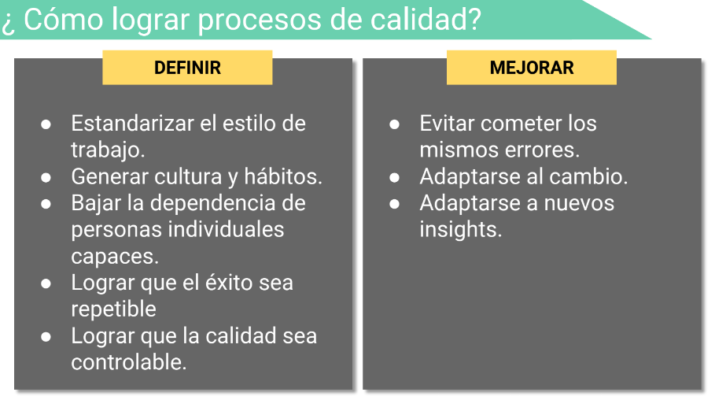

# Calidad y procesos
La calidad del proceso influye positivamente en la calidad del producto.
El objetivo debe estar en obtener **productos de calidad**.
## ¿Cómo lograr procesos de calidad?

- Estandarizar
- Generar hábitos
- Éxito repetible
- Eliminar personas clave
- Lograr calidad controlable
- Evitar demasiada burocracia (netflix)
- Evitar solidificación (netflix)

## Normalización del desvío
Cuando la gente se acostumbra a deviant behavior tanto que no lo consideran como deviant.