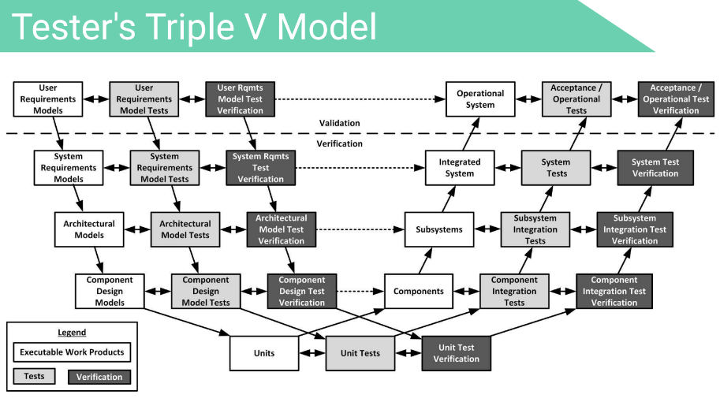
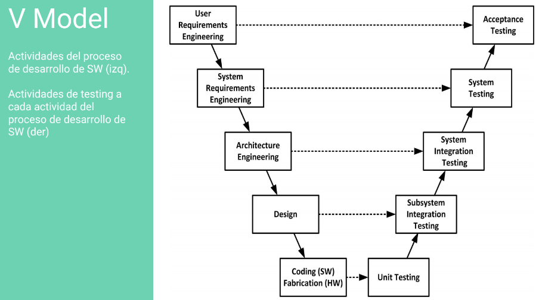

# Testing
Verificación dinámica del comportamiento de un programa sobre un conjunto finito de casos de prueba.

Actividad desarrollada para evaluar la calidad del producto, y para mejorarlo al identificar defectos y problemas.

Se pueden testear distintos artefactos y se puede hacer testing en distintas fases.

## Prueba
Definición: Conjunto de tareas que pueden definirse, planearse y realizarse de manera sistemática. Se documentan en formularios.

Hay pruebas de distintos niveles de abstracción (unit-integration-....).

## Control de calidad
Más temprano detección, más barata la corrección.
- Validación: ¿Estamos construyendo el producto correcto?
- Verificación: ¿Estamos construyendo el producto correctamente?

## Pruebas de aceptación de usuario (UAT)
- Un cliente: verificación criterios de aceptación
- Multiples clientes: alfabeta
  - alfa: el usuario lo prueba en el ambiente de desarrollo con el desarrollador
  - beta: el usuario lo prueba en su ambiente